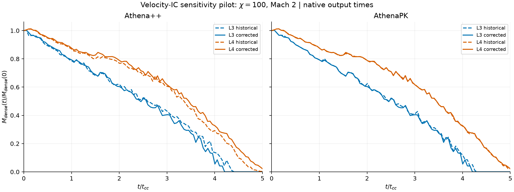

# Cloud Studio

### Native simulations. Measured results. Interactive 3D.

Cloud-crushing research by **Kaan Boge**, with mentorship from **Dr. Ryan Farber** through Horizon/HARP. The project studies how a dense cloud evolves in a hot wind using independent hydrodynamics codes.

**[Explore the research & data](https://kaanboge.github.io/cloud-studio/research.html)** · **[Open the 3D viewer](https://kaanboge.github.io/cloud-studio/viewer.html)** · **[Browse movies & images](https://kaanboge.github.io/cloud-studio/)** · **[Download the evidence bundle](https://kaanboge.github.io/cloud-studio/downloads/research-evidence-2026-09-09.zip)**

> **Read the status before comparing.** The historical viewer is a visualization archive, not a certified matched-code experiment. The validated velocity-sensitivity study is separate. Its latest published summary contains **50 accepted controls, 25 pairs and 5,054 analyzed native states**. A new Enzo level-5 pair is underway at the dated publication check; it is not included in those accepted totals.

## Start here

| If you want to… | Open |
|---|---|
| Rotate, zoom and compare cloud structures | [Interactive 3D viewer](https://kaanboge.github.io/cloud-studio/viewer.html) |
| Read the current scientific findings | [All-code velocity-sensitivity summary](analysis/sensitivity_20260907/resolution_summary_v2/README.md) |
| Find reports, scripts, checks and figures | [Research hub](https://kaanboge.github.io/cloud-studio/research.html) · [Analysis directory](analysis/) |
| Check how many frames a historical entry contains | [Frame inventory CSV](data/streaming-inventory.csv) · [JSON](data/streaming-inventory.json) |
| Inspect the new Enzo level-5 preparation | [Pinned plan and validation](analysis/sensitivity_20260907/enzo/l5_direct_v1/PLAN.md) |
| Understand what is public versus retained locally | [Data guide](docs/DATA.md) |
| See what remains to be simulated | [Research roadmap](docs/ROADMAP.md) |
| Reproduce or review the workflow | [Methods and reproducibility](docs/METHODS.md) |

## What is being tested?

Ryan's current request is to measure the effect of the velocity prescription at a few resolutions **before deciding which historical runs need replacing**. Each accepted within-code pair uses the same native executable, grid or initial particle sampling, numerical settings and physical parameters. Only the chosen velocity law and its consistent kinetic energy change.

The pilot fixes **χ = 100, Mach = 2, γ = 5/3**, with the existing density edge and domain. AthenaPK's historical prescription was constant outer momentum; it was not the same tanh-velocity prescription used by the other accepted pairs. Native boundary, tracer and SPH pressure caveats are retained, not hidden behind a common label.



*One part of the study: the original two-code pilot. Curves use the measured native outputs. See the [updated all-code report](analysis/sensitivity_20260907/resolution_summary_v2/README.md) for the wider evidence; this image is not a code ranking or a convergence proof.*

## Independent native codes

| Code / method | Execution in this project | Published sensitivity evidence |
|---|---|---|
| AthenaPK | CUDA/GPU | [L3–L4](analysis/sensitivity_20260907/README.md) |
| Athena++ | MPI/CPU | [L3–L4](analysis/sensitivity_20260907/README.md) |
| Athena 4.2 | MPI/CPU | [L3–L5](analysis/sensitivity_20260907/athw/README.md) |
| Enzo | MPI/CPU | [L3–L4](analysis/sensitivity_20260907/enzo/README.md) · [new L5 preparation](analysis/sensitivity_20260907/enzo/l5_direct_v1/PLAN.md) |
| Enzo-E | Charm++/CPU | [L3–L4](analysis/sensitivity_20260907/enzoe/README.md) |
| RAMSES | MPI/CPU | [L3–L4](analysis/sensitivity_20260907/ramses/README.md) |
| FLASH 4.8 | MPI/CPU | [L3–L4](analysis/sensitivity_20260907/flash/README.md) |
| Flash-X | MPI/CPU | [L3–L4](analysis/sensitivity_20260907/flashx/README.md) |
| Arepo | MPI/CPU, moving mesh | [L3–L4](analysis/sensitivity_20260907/arepo/README.md) |
| GIZMO MFM | MPI/CPU, mesh-free finite mass | [L3–L4](analysis/sensitivity_20260907/gizmo/README.md) |
| GIZMO MFV | MPI/CPU, mesh-free finite volume | [Repaired L3–L4](analysis/sensitivity_20260907/gizmo/mfv_analysis_levels_v1/README.md) |
| Gadget-4 | MPI/CPU, SPH | [L3–L4](analysis/sensitivity_20260907/gadget4/analysis_levels_v1/README.md) |
| Gasoline | CPU, SPH | [Validation hold](analysis/sensitivity_20260907/gasoline/FORCE_ORDER_RESULTS.md) |

These are twelve code families and thirteen methods when GIZMO MFM and MFV are counted separately. Results are produced by each code's own solver, not by relabelling FLASH output.

## Resolution means a physical grid—not movie resolution

| Project level | Streamwise × transverse × transverse | Initial elements per cloud radius |
|---|---|---:|
| 1 | 16 × 8 × 8 | 0.8 |
| 2 | 32 × 16 × 16 | 1.6 |
| 3 | 64 × 32 × 32 | 3.2 |
| 4 | 128 × 64 × 64 | 6.4 |
| 5 | 256 × 128 × 128 | 12.8 |
| 6 | 512 × 256 × 256 | 25.6 |

The domain is 20 × 10 × 10 cloud radii. **Level 6 is not 512³.** For moving-mesh and particle codes, this ladder describes the initial sampling; it does not guarantee identical evolved spatial resolution. Levels 1–2 do not resolve a cloud well enough for quantitative convergence conclusions.

## From a simulation to the website

```text
Native code + pinned input
        ↓
3D output fields + logs + restart data, retained locally
        ↓
Native readers / yt → checked mass, time and field diagnostics
        ↓
matplotlib figures · extracted 3D surfaces · ffmpeg movies
        ↓
GitHub Pages + the existing streamed-mesh frames branch
```

The website displays derived results; uploading an arbitrary HDF5 file does not turn it into a movie. The viewer uses recorded frame timestamps; this catalog does not independently revalidate them against every original native file. A target of 101 snapshots is **not** a promise that every historical entry has 101 frames, identical intermediate times, or all cloud material inside the box.

## Data and repository layout

```text
research.html          Research reports, data downloads and status guide
index.html             Existing image/movie studio
viewer.html            Existing interactive 3D viewer
analysis/              Custom analysis scripts, reports, diagnostics and figures
data/                  Viewer manifests and downloadable research/frame catalogs
assets/                Published movies and images
docs/                  Methods, data policy, roadmap and update notes
downloads/             Portable research-evidence bundle
vendor/                Existing browser dependencies
```

The separate [`frames` branch](https://github.com/KaanBoge/cloud-studio/tree/frames) holds compressed **derived mesh frames**, not complete native fields. [File inventory and SHA-256 checksums](data/research-files.csv) make the published analysis package inspectable. The [download scope](docs/DATA.md) explains bundle exclusions.

**No raw output was deleted for this publication.** The local storage inventory is metadata, not a cloud backup. [Compression tests](analysis/storage_20260909/compression_probe.json) restored every tested byte, but compression has not been enabled for the active Enzo pair.

## Scientific limits and next steps

* The blanket replacement queue remains inactive. Reuse decisions require the sensitivity evidence, historical provenance and a scientific tolerance agreed with Ryan.
* Gasoline's field-repeatability gate remains failed. Completed diagnostics are not accepted full controls.
* Earlier cooling-labelled cases **did not enable cooling**. They are not radiative results; physical cooling units/table choices and independent validation are still required.
* Existing frame-tracking tests verify several implementation properties, but **do not establish complete cloud-material retention**.
* Movies and quantized isosurfaces are not replacements for native pressure, energy, velocity or tracer fields.

See [verification](https://kaanboge.github.io/cloud-studio/verification.html), [tracking/cooling evidence](analysis/followup_20260907/README.md), and the [roadmap](docs/ROADMAP.md).

## Reuse, attribution and contributions

This repository is maintained by **[KaanBoge](https://github.com/KaanBoge)**. Please cite the particular report and commit used; [CITATION.cff](CITATION.cff) provides project metadata. No DOI or peer-reviewed publication is claimed.

Upstream simulation codes retain their own licenses and access requirements. This repository does not grant a blanket license over third-party solvers or data. See [contribution and review guidance](CONTRIBUTING.md) before proposing changes. Never overwrite accepted evidence or silently change a scientific acceptance rule.
