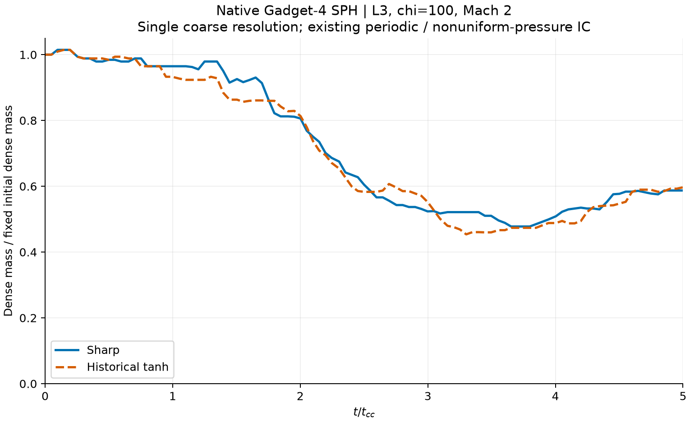

# Native Gadget-4 L3 velocity sensitivity results

8 September 2026. Both full native L3 controls are complete and analyzed:
101 distinct native outputs each through 5 t_cc, all 202 independently
checked with yt. These two controls bring the analyzed study total to 44.
This is a single coarse-resolution result, not convergence or a universal
historical-reuse decision.

Sharp took 75.22 seconds and historical took 75.73 seconds on eight MPI
workers, with median sampled busy CPU 7.996/8.000 workers and peak summed
solver-child RSS 0.406/0.407 GiB. Solver times exclude validation/publication.
Peak dense-mass curve separation is **6.954% of fixed initial dense mass**.
Final dense fractions are 0.58718/0.59670. All native data remains retained.

See [the complete diagnostic series](l3_report.json),
[completed full native ledger](full_l3_batch.json) and [validation](VALIDATION.md).

## What is being compared

Chi=100, Mach=2, gamma=5/3, R=1, nominal wind density and pressure=1,
tanh density width=0.1R and velocity boundary radius=1.3R. L3 starts on a
64 x 32 x 32 regular equal-volume lattice (65536 particles, 3.2 elements/R).
Masses vary with the prescribed density. Both controls use identical IDs,
positions, masses, initial internal energies and numerical parameters.
Only velocity is changed between sharp and actual archived tanh laws.

The archived writer reproduces **every array of the old L3 chi100 IC exactly**.
The old L3/L4 run links resolve to the same native executable as this study.
The current sharp writer and historical writer are pinned separately in
[build.json](build.json), alongside native source/configuration hashes.

## Important native pressure and boundary limitation

**This is not a uniform-pressure, matched grid-code baseline.** Gadget-4's
SPH density estimate differs from the analytic mass-per-lattice-volume
density. Initial pressure peaks at about 3.9003 times the nominal pressure,
a 290.03% positive deviation, identically in both controls. All native
nonvelocity initial fields are exactly equal between the controls, so this
is a velocity-sensitivity experiment within that existing Gadget-4 setup.
No density, energy, smoothing tolerance or field was changed to hide it.

The 20 x 10 x 10 box is fully periodic, unlike the grid wind tunnel's
inflow/outflow boundaries. IDs at or above 1000000000 tag the initial
r <= R particles; this is not a new scalar field and excludes the outer
density tail. In-box tagged mass cannot establish that no particle crossed
a periodic boundary. No all-material-retained image claim is made.

## Native executable provenance

This is the existing **Gadget4_3d_mixed_hfix** executable, not FLASH or a
substitute solver. Native logs identify Gadget 4.0, source commit
`2046797b578a3be27433a23a9ba912715a829626`, compiled with `-O3 -march=native`.
SHA256: `5ab857aba8cf4213fbce701ae8eaa6c449f5de43c0b9ab61722e962d88dca8d3`.
It was copied byte-for-byte; no solver code was rebuilt or changed here.

It is **not pristine upstream Gadget-4**: a pre-existing smoothing-length
initialization patch uses mean gas particle mass and clamps the initial
guess to half the shortest periodic dimension. Both laws retain this same
patch. The old notes acknowledge that finite neighbor tolerance can change
which smoothing length is accepted; claims that it cannot change any
converged value are not adopted as evidence of bitwise equivalence.

Native config: PERIODIC, NTYPES=2, LONG_Y_BITS=1, LONG_Z_BITS=1,
DOUBLEPRECISION=2, POSITIONS_IN_32BIT, OUTPUT_PRESSURE. No cooling,
self-gravity, magnetic field or frame shifting is compiled in this recipe.
L3 retains CourantFac=0.15, DesNumNgb=64, MaxNumNgbDeviation=2,
MaxSizeTimestep=0.05, MinEgySpec=0 and MaxMemSize=1000 MB per rank.

## Completed checks

Sharp and historical smokes each wrote two native states at code times 0
and 0.1. Solver times were 0.817/0.753 seconds, with sampled peak summed
child RSS 0.387/0.387 GiB. These are tiny tests, not full-run forecasts.
All four outputs are finite with positive density, mass, internal energy,
pressure and smoothing length. Native pressure agrees with reconstructed
pressure within 2.8e-7 relative difference. All three direct mass sums
(total, density-selected and ID-tagged) agree independently with yt, with
zero reported discrepancy in all four files. Raw hashes are unchanged.

Native coordinates and scalar/velocity fields are float32; particle IDs are
uint32. Initial coordinates, masses and velocities equal their IC values
at native storage precision; initial internal energy differs by at most
1.19e-7. This differs from GIZMO's initial half-step velocity issue. Evolved
velocity synchronization still needs explicit review before using those
velocities for time-specific diagnostics.

See [verification_v2.json](verification_v2.json),
[the unchanged smoke ledger](smoke_batch.json), and [the validation plan](VALIDATION.md).
The first report-writing attempt failed on a NumPy float32 JSON value after
the numerical checks; its partial file and checker are retained. The fix
converts that report value to a Python float. It does not alter a tolerance,
rerun either simulation or rewrite an output.

## Completed full pair, timing correction and preservation

[The original runner](run_full_l3.py) stopped after the sharp solver finished
because its custom cadence check incorrectly allowed only late outputs.
This was a checker error, not a solver failure. [The original stopped ledger](original_stopped_batch.json)
and [launch-time bundle](full_l3_bundle.json) are retained as evidence, not
runnable continuations. Do not relaunch them.

[The corrected native time audit](native_cadence_audit.json) reconstructs the
pinned `run.cc` scheduling rule exactly: a requested time is rounded to the
nearest permitted power-of-two block, which can be earlier or later. Its
block is 0.0378221029903 code units; the observed offsets are at most
plus/minus 0.0181546094353. Every actual sharp header matches the reconstructed
schedule with zero reported discrepancy. No timestamp was changed.

[run_full_l3_v2.py](run_full_l3_v2.py) revalidated the saved sharp data and
then ran only the never-started historical case, in a new directory. It did
not rerun sharp or resume a checkpoint. Both controls now pass all native,
independent-reader and exact-scheduler checks. [The corrected frozen bundle](full_l3_v2_bundle.json)
records the original 18 tests plus five cadence regression tests; four
additional analysis tests pass. Frozen runners must not be edited or
restarted into existing directories.
Only file paths and metadata-derived final/output/statistics times differ
from the historical parameter template. Native production numerics and the
7200-second restart interval stay unchanged. No checkpoint auto-resume.

Both cases produced 101 native times through 5 t_cc. This original build
rounds requested times to native synchronization blocks. Actual early/late
times are retained and identical within this pair, not relabeled as exact
0.05 t_cc intervals. The mass plot uses every actual native time; only the
reported scalar peak uses declared linear interpolation onto 0:0.05:5 t_cc.
The denominator is the fixed initial dense mass, 409.90798235 in both cases,
with the density threshold rho > rho_cloud_initial/3 at every time.

Measured native snapshot size is 3159560 bytes, eight-rank restart set
14453866 bytes, IC 4724840 bytes. The complete retained pair budget is
1548278722 bytes (1.442 GiB), including 104 snapshots, three measured restart
sets, ICs, a 256 MiB log allowance per case and 20% extra margin. A separate
10 GiB reserve is required on both guest and Windows backing drive. RAM
preflight requires 12 GiB available; running low-memory and storage guards
request a native checkpoint/stop. An external 6000-second case limit bounds
restart growth; native stop receives 60 seconds grace. No guard removes data.

Completed ledger: `/home/kaan/sensitivity_20260907/gadget4/full_l3_continuation_v2/batch.json`.
Sharp raw remains under `full_l3_v1/sharp13`; historical raw is under
`full_l3_continuation_v2/tanh13`. The immutable analysis is `analysis_l3_v1`.
All raw fields, ICs, logs, restarts and failed attempts stay local. L4 requires
its own native validation before a larger full pair; L5 is not enabled.
These controls are not new production entries in the 3D viewer.

Scripts are machine-specific and use `/home/kaan/venv/bin/python` under WSL.
Never rerun setup, smokes or full scripts into existing directories. Historical
generator comments are archived provenance, not current scientific claims;
use the guarded wrappers, not an unchecked direct overwrite command.

This public package contains custom scripts, metadata, configs and diagnostic
evidence. Native solver source, binaries and raw data are not published here.
