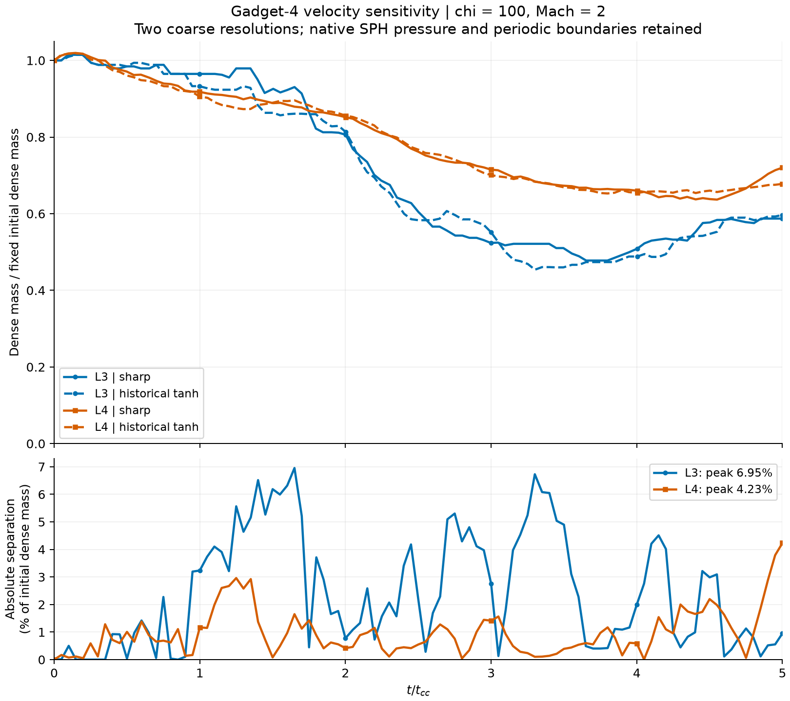

# Gadget-4: velocity sensitivity at two resolutions

8 September 2026. All four native Gadget-4 controls are complete: two laws at
L3 and L4, with 101 actual saved states per run through 5 t_cc. The two new
L4 controls bring the study to 48 accepted full controls, containing 4,852
native analysis states. Six L3/L4 controls remain: four Gasoline and two
repaired GIZMO MFV. Higher levels are additional, separately guarded work.

## What the comparison shows

| Initial resolution | Elements per cloud radius | Peak paired dense-mass separation | Time of peak | Final sharp / historical dense fraction |
|---|---:|---:|---:|---:|
| L3: 64 x 32 x 32 | 3.2 | 6.954% | 1.65 t_cc | 0.58718 / 0.59670 |
| L4: 128 x 64 x 64 | 6.4 | 4.232% | 5.00 t_cc | 0.72012 / 0.67780 |

The effect is smaller at L4 in this diagnostic, but these two coarse levels
do not establish convergence, negligible impact, an accuracy ranking or a
universal decision to reuse historical runs. The separation is a percentage
of the initial dense mass, not percentage error relative to an exact answer.

## Conditions and calculation

Chi=100 and Mach=2 are fixed. Each pair uses the same native executable,
parameters, IDs, coordinates, masses, initial thermal energy and boundaries.
Only the initial velocity changes: zero inside 1.3R with constant wind
outside, versus the actual archived tanh velocity transition centered at
1.3R. Density retains its original tanh width of 0.1R. No native source was
rebuilt for these new full controls.

Dense mass means rho > initial cloud density / 3. Each resolution pair has
one fixed measured native initial dense-mass denominator: 409.9079823494
at L3 and 405.9495101273 at L4, in code mass units. Every actual native time
is plotted. Only the scalar peak comparison uses explicit linear
interpolation onto 0:0.05:5 t_cc. No native frame is duplicated, omitted,
interpolated or retimed. Native output timing follows Gadget's own scheduler,
which can round a requested output earlier or later.

## Validation and limitations

The new native runner independently checked all 202 L4 states with yt and
direct particle-field sums, checked positivity/finite fields, IC identity,
the exact output schedule and paired nonvelocity fields. The new analysis
reuses those completed checks and re-verifies all 202 snapshot and 16 restart
byte hashes, the case/batch ledgers, 19 frozen source/input pins and resource
logs. Twelve new scalar-analysis tests pass. A separate pure-Python scalar
interpolator agrees within 2.23e-16. The accepted L3 report is reused without
rerunning L3 simulations or reading their raw fields again.

The existing Gadget4_3d_mixed_hfix executable retains a pre-existing
smoothing-length seed patch. It is not pristine upstream Gadget-4 and is
not FLASH. Native SPH initial pressure differs from the analytic nominal
pressure: the L3 peak is about 3.9003 times nominal; L4 ranges from 0.808274
to 2.104201. These fields match within each law pair, but they are not a
uniform-pressure baseline matched to the grid codes. Fully periodic
boundaries permit recirculation; an in-box ID-tag mass of one does not prove
that nothing crossed a boundary. ID tags cover initial r <= R, not the whole
density tail. Evolved velocity synchronization remains unvalidated; these
are mass diagnostics. Retained restart hashes do not certify restart recovery.

## Resources and retained files

| New L4 law | Solver wall time | Median busy CPU workers | Peak summed solver-child RSS | Native states |
|---|---:|---:|---:|---:|
| Sharp | 760.19 s (12m40s) | 7.989 / 8 | 1.801 GiB | 101 |
| Historical tanh | 754.21 s (12m34s) | 7.989 / 8 | 1.777 GiB | 101 |

This is CPU-only simulation; no GPU solver is involved. Times exclude
subsequent native validation and publication. L4 wrote directly to Windows
C: while the old L3 runs used WSL ext4, so their runtime ratio is not a
controlled speedup or resolution-scaling benchmark. No old raw data was
moved or deleted, and the new ICs, snapshots, restart files and logs remain.
Ten-GiB free-space reserves and the full pair budget were guarded.

Raw directory:
`C:/Users/kaanb/CloudCrushing/native_runs/sensitivity_20260907/gadget4_L4_velocity_pair_v1`.
Each law directory contains `ics.hdf5`, `params.txt`, `result.json`,
`run.log`, `resources.jsonl`, `output/snapshot_000.hdf5` through
`snapshot_100.hdf5`, and `output/restartfiles/restart.*`.
Do not relaunch the completed frozen runner or overwrite these results.

## Scripts and evidence

[All scalar series and metrics](report.json), [new analysis validation](validation.json),
[completed native L4 batch](full_l4_batch.json), [frozen native plan](full_l4_plan.json),
[Windows readback proof](windows_readback.json), [analysis script](../analyze_levels_v1.py),
[scalar tests](../test_levels_v1.py), [native launch wrapper](../run_l4_direct_storage.py),
[wrapper tests](../test_l4_direct_storage.py), [preparation](../prepare_l4_direct_storage.py),
[Windows launcher](../launch_l4_direct_storage.ps1), [storage plan](../L4_DIRECT_STORAGE_PLAN.md).

This publication contains analysis and custom scripts, not new production
3D-viewer entries or a backup of native data. It does not validate cooling,
MHD, other Mach numbers, Galilean tracking or all-material-retained figures.
The blanket replacement queue remains inactive.

Publication checklist: new tests and independent calculations pass; plot
visually reviewed; source/native retention verified; only analysis paths
staged. Require successful Pages deployment and matching live byte hashes
before reporting publication. If a mismatch occurs, withhold the claim and
correct only the affected custom artifacts; do not alter native evidence.
