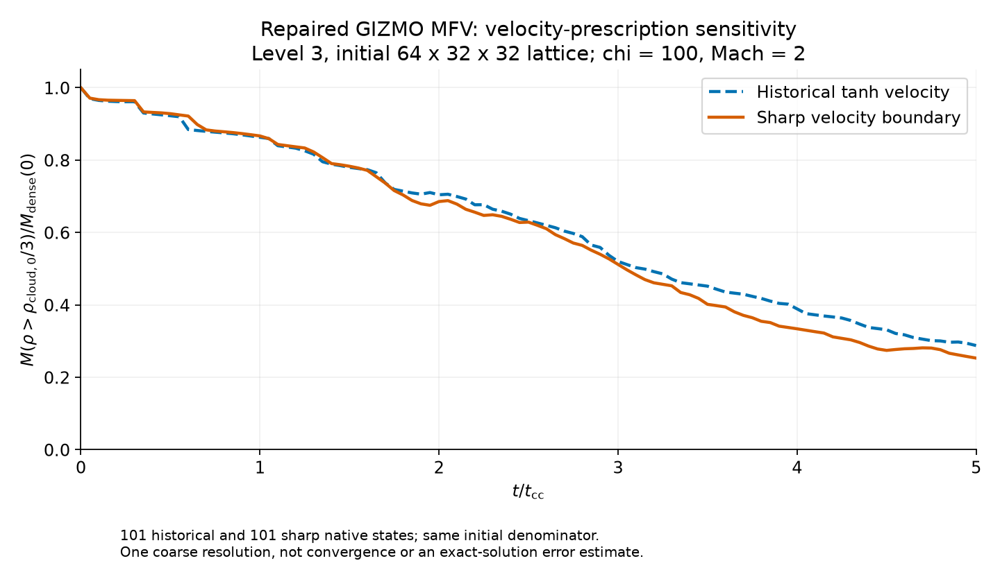

# Repaired MFV Level 3 velocity pair: validated

8 September 2026. **Both repaired MFV controls now pass through5 t_cc, with
101 actual native frames each.** Only the missing sharp case was newly run;
the completed historical repair diagnostic was reused after verifying its
entire recipe and every raw-frame/restart hash. The accepted study total is
now **46 controls**. The two original failed MFV attempts remain excluded.

## Result and interpretation

The maximum dense-mass curve separation is **6.438% of the fixed measured
initial dense mass**, occurring at3.95 t_cc on the declared scalar comparison
grid. The initial dense mass is409.90798234939575 code-mass units. Final
fractions are0.25306 for sharp and0.28771 for historical velocity.

This is one coarse initial64x32x32 lattice (3.2 elements per cloud radius),
not convergence, an exact-solution error or a universal old-run reuse decision.
Both curves use all actual native times. Only the descriptive peak uses
explicit linear interpolation of scalar masses onto0:0.05:5 t_cc; no3Dframe
is interpolated, discarded, duplicated or retimed. Dense mass is selected by
rho>initialcloudrho/3 and normalized by the same measured initial denominator.

## What changed, what did not

Both runs use the SAME isolated native GIZMO MFV executable with the previously
validated one-assignment mass-flux timestep repair. No further native source
change or rebuild occurred. The full sharp input is byte-identical to the full
historical input; IC arrays and headers are identical except velocity.
Chi100, Mach2, gamma5/3, density tanh edge0.1R, velocity radius1.3R, periodic
20x10x10 box, original floors, precision, neighbor settings and eight ranks
remain unchanged. Sharp velocity is zero through1.3R and wind speed outside;
historical velocity has the original tanh transition.

The repair executable is
`/home/kaan/sensitivity_20260907/gizmo/mfv_timestep_repair_v1/repaired/GIZMO_repaired`,
SHA256`4784336422c25db4714c6f56ef95337347f4be18dfd622e2b7e9acf7e1fe3d3c`.
The original failed executable and all original outputs remain retained and
are NOT pooled with these repaired controls.

## Checks

Three new short sharp diagnostics produced eight actual native outputs.
Every initial nonvelocity field matches the repaired historical short/full
initial fields and the original sharp initial fields exactly at native dtype.
The two new sharp timing diagnostics recover half-kick scaling0.50013555
and zero-step error2.3842e-7, below the unchanged1.2312e-6 float32 bound.
Native velocities remain staggered and must not be interpreted as simultaneous
with their snapshot header. No extrapolated field replaces a simulation output.

All101 full sharp states pass finite/positive native-field checks and independent
yt mass sums, with zero reported direct/yt discrepancy. The retained historical
101-state independent checks were reused only after all native hashes matched.
Initial paired density, masses, energy, coordinates, IDs and smoothing lengths
match exactly. Both schedules pass the source-derived60-bit clock; maximum
sharp schedule offset3.55e-15 code time is below3.4433e-14 allowance.

All eight new terminal restart prefixes pass exact-executable ABI, ID, clock,
finite/positive energy/pressure/mass checks and independent struct mass sums.
Sharp combined MassTrue plus pending dMass residual is-6.5522e-14 code mass,
below the unchanged prospective engineering allowance0.0022311. All65536
conserved masses respond;1974 native synchronization steps. Minimum stored
sharp internal energy across all times is0.01060877; terminal double internal
energy minimum0.02437603 and pressure minimum0.63447012. The old stored-energy
failure does not recur in either repaired L3 law. The engineering mass gate
is not a rigorous arbitrary-flux or physical-accuracy bound. Prefix decoding
does not certify the unparsed restart tail for checkpoint resume.

Sixteen preparation tests and seven full-run/analysis tests pass. Negative
checks cover changed fields/dtypes, missing or disordered times, failed mass
accounting, JSON scalar types and overwriting a completed report. The paired
plot was visually reviewed: readable axes/legend, native-time curves, fixed
denominator, no obscured data and explicit coarse-resolution caveat.

## Measured resources and remaining scope

The new full sharp case took136.16seconds (2m16s), with median7.926 busy CPU
workers and peak581902336bytes (0.542GiB) solver-child RSS;1272 resource samples.
No GPU or guard-triggered stop. The reused historical case took126.99seconds
(2m07s), with eight busy CPU workers and0.543GiB. These are observed process
wall times including launcher sampling overhead, not a controlled speedup
benchmark or Level6 estimate. All raw states, checkpoints, ICs and logs remain.

Eight full controls remain unlaunched in the stated L3/L4 scope: two Gadget-4
L4, four Gasoline L3/L4 and two MFV L4. Higher storage-held levels are additional.
No full-matrix ETA is established. After the new runs WSL had about14.43GiB
free, before small analysis artifacts; separate10GiB reserves remain required.

These data do not certify finer MFV levels, cross-code matching pressure or
boundaries, cooling, frame tracking or all-material retention. The fully
periodic box permits recirculation, and MFV particle-ID mass is not a passive
material tracer. These are published analysis controls, not new production
3Dviewer entries; plots/meshes are not raw-data backups.

## Reproducible artifacts

Native root: `/home/kaan/sensitivity_20260907/gizmo/mfv_timestep_repair_v1`.
Fresh completed directories: `sharp_prepare_runner_v1`, `sharp_prepare_native_v1`,
`sharp_full_runner_v1`, `sharp_full_native_v1`, `sharp_pair_plot_v1`.
Do not relaunch completed runners or overwrite their records. Both shared
locks and independent host/guest storage guards applied throughout.

[Preparation protocol](MFV_SHARP_PREPARATION_PLAN.md),
[preparation runner](mfv_sharp_prepare.py), [tests](test_mfv_sharp_prepare.py),
[frozen preparation plan](sharp_prepare_plan.json),
[eight-state evidence](sharp_prepare_validation.json),
[full protocol](MFV_SHARP_FULL_PLAN.md), [full runner](mfv_sharp_full.py),
[full tests](test_mfv_sharp_full.py), [frozen full plan](sharp_full_plan.json),
[native resources](sharp_full_result.json), [202-frame paired diagnostics](mfv_repaired_pair.json),
[plotter](plot_mfv_repaired_pair.py), [plot provenance](mfv_repaired_plot.json).

Pair report SHA256:
`db45f9d985a4e8eb87b63f0247d1d5f61572acfaab5dad6f9272dfe36b0a017d`.
Historical evidence and corrections remain in
[the original onset report](MFV_ONSET_VALIDATION.md).
