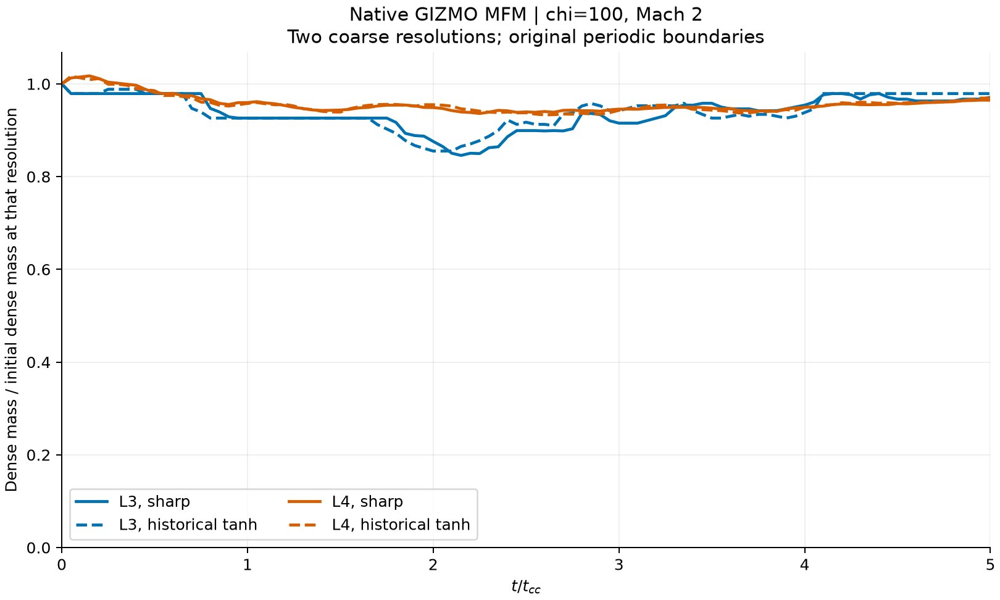
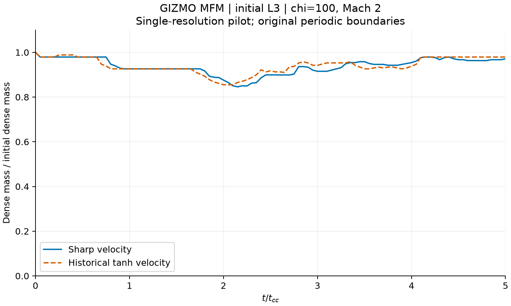

# Native GIZMO sensitivity: MFM L3/L4 complete, MFV L3 needs review

Updated 8 September 2026. The four full **MFM L3/L4** controls are validated and
analyzed. The current study total, including Gadget-4 L3, is **44 accepted controls**. Each has 101
distinct native snapshots through 5 t_cc. The two **MFV L3** attempts also
reached 101 snapshots, but both failed positive-energy checks and are excluded
from that total. Both accepted MFM pairs have finished; their runners must
not be relaunched into the existing directories.

## Level 4: full pair and resolution overlay complete

The separate native MFM L4 pair started at 07:50 local time on 8 September
and is complete. Sharp took 794.84 seconds (13m15s); historical took 791.16
seconds (13m11s). Each produced 101 distinct native times through 5 t_cc,
and all 202 full states passed native field and independent yt mass checks.
Median sampled busy CPU was 8.000 workers in each case; peak solver-child
RSS was 1.626/1.636 GiB. These are CPU-only solver costs, excluding analysis.

The combined L3/L4 analysis freshly hash-checked and recomputed mass from all
404 accepted native states. Peak separation is **3.979% at L3 and 0.955% at
L4**, expressed relative to the fixed measured initial dense mass at each
resolution. This is two coarse resolutions, not demonstrated convergence,
a quality-error estimate or permission to reuse every historical result.
Six analysis unit tests pass; no production numerical setting was changed.

See [all four diagnostic series](mfm_levels_report.json),
[combined validation and caveats](MFM_LEVELS_VALIDATION.md), and
[the completed native L4 ledger](mfm_l4_batch.json).

Two L4 short evolved controls and four separate timestep-scaling diagnostics
passed all16 actual native snapshot checks, including independent yt mass
sums. Nine additional L4 unit tests pass. Native initial nonvelocity fields
match exactly within the pair; kernel density/pressure deviations from the
nominal target are at most0.09215%, identical for both laws. Level-specific
offset-halving ratios are0.499991/0.500309, with zero-step recovery error
2.3842e-7 below the float32 bound1.2312e-6. This is L4 evidence, not reuse of
the L3 arrays. Native velocities and snapshot times remain untouched.

The full pair produced 101 native snapshots per case through 5 t_cc on the initial
128x64x64 lattice (524288 elements,6.4 elements/R). Actual measured native
snapshot size is33,563,880bytes; eight-rank restart-set size335,777,344bytes.
The complete retained pair budget is10.25GiB plus a separate10GiB reserve on
both filesystems. The short evolved cases took6.40/6.25seconds, peaking at
1.58GiB child RSS; these are test costs, not full-run completion estimates.

See [L4 validation evidence](mfm_l4_validation.json),
[the test plan](L4_VALIDATION_PLAN.md), [frozen runner proof](mfm_l4_bundle.json),
and [the full L4 runner](mfm_l4_controls.py). The native live ledger is
`/home/kaan/sensitivity_20260907/gizmo/full_mfm_l4_v1/batch.json`.
`status_mfm_l4.py` checks actual worker directories and readable output headers;
progress observations are not a substitute for final full-field validation.

## Earlier L3 findings and retained MFV failures

| Native method and velocity law | Snapshots | Solver time | Peak child RSS | Outcome |
| --- | ---: | ---: | ---: | --- |
| MFM sharp | 101 | 82.37 s | 0.489 GiB | Validated for mass diagnostics |
| MFM historical tanh | 101 | 82.13 s | 0.488 GiB | Validated for mass diagnostics |
| MFV sharp | 101 | 128.34 s | 0.544 GiB | Zero stored energy in 15 snapshots |
| MFV historical tanh | 101 | 127.96 s | 0.544 GiB | Zero stored energy in 16 snapshots |

All four cases used eight MPI workers. Median sampled busy CPU cores were
7.996-8.000; these are CPU simulations, not GPU runs. Solver times exclude
the subsequent validation and publication work. RAM figures are solver-child
RSS, not total Windows/WSL memory or an allocation target.

MFM's peak absolute mass-curve separation is **3.979% of the fixed initial
dense mass**. Final dense fractions are 0.97111 (sharp) and 0.97910 (historical).
All 202 native mass sums were independently checked with yt, with zero reported
relative discrepancy. Fresh pre-publication raw hashes and direct sums also
match. Density selection is rho > rho_cloud_initial/3. The plot uses every
actual time; the scalar peak uses explicitly stated interpolation onto
0:0.05:5 t_cc. No 3D frame is interpolated or repeated.

This earlier plot is **one coarse resolution**. The new L3/L4 overlay above
supersedes it for resolution comparison, without changing the old analysis.
See [the original MFM L3 series](mfm_l3_report.json)
and [the dated L3 pre-delivery validation](VALIDATION.md).

## MFV failure evidence: preserved, not certified

A further [mass-update diagnosis](MFV_MASS_UPDATE_DEFECT.md) found an
uninitialized timestep in the original native MFV flux routine, confirmed by
GCC. At the retained endpoint all65536 conserved masses per case exactly equal
their IC values despite nonzero instantaneous mass fluxes. This is a concrete
source defect; an isolated repair/evolution test is planned, not yet performed.
No native source, binary, floor or dataset changed. MFV remains excluded.

The [terminal restart diagnosis](MFV_RESTART_DIAGNOSIS.md) now explains the
final exported zeros: internal double-precision energies are positive but tiny;
three underflow float32 and one is flushed from a float32 subnormal to zero by
the exact executable's FTZ setting. Independent readers checked all131072 final
particles,202 original snapshot hashes and16 restart hashes. Why the non-radiative
thermal energy became so small is still unvalidated. This is not a new accepted
pair, repaired output or reason to start larger MFV runs.

In both laws, the first zero `InternalEnergy` occurs at native snapshot079,
t=3.95 t_cc: particle ID109 in sharp and ID99 in historical. There are 15 and
16 affected snapshots respectively. Both native solvers exited normally;
that is not sufficient for valid science output. All other stored fields are
finite, and mass, density and smoothing length remain positive in this audit.

The pinned native `io.c` writes `max(MinEgySpec, InternalEnergyPred)` for this
field. Zero stored energy therefore does not, by itself, prove the conserved
energy is zero or establish the numerical root cause. The failure occurs in
both prescriptions, so it cannot be attributed solely to the sharp boundary.
No floor, timestep, native field, file, or acceptance criterion was changed.

The original runner stopped on the sharp-case validation error. The historical
case was then launched explicitly from its already prepared, never-started
directory as an unchanged failure-comparison control, not a checkpoint restart.
See [all 202 native field audits](mfv_pair_audit.json), the
[original stopped batch](full_l3_batch.json), and the separate
[historical-control record](mfv_failure_control.json). Failed MFV states are
not pooled into the MFM mass result or represented as valid viewer entries.

## Scope and provenance

Chi100, Mach2, gamma5/3, R1, nominal wind density/pressure1, tanh density edge
0.1R and velocity radius1.3R, regular equal-volume lattice, variable masses,
seed42, eight MPI ranks. Both native variants retain their original fully
periodic 20x10x10 domain. This is not the grid codes' inflow/outflow baseline.
L3 is64x32x32 with3.2 initial points per cloud radius, not a convergence test.

The actual current sharp and archived tanh IC writers are pinned separately.
All IC arrays except velocity are exactly equal within each pair. Metadata
not represented by the native parameter file is explicitly hashed in
`experiment.json`; it is not inferred from filenames or positional arguments.
Native per-level parameter templates, config flags and source/binary hashes
are in `build.json`. Historical comments are provenance, not an endorsement
of their scientific claims. The native MFM/MFV executables are byte-identical
copies of GIZMO_MFM_3D_PER/GIZMO_MFV_3D_PER. No solver code was modified or rebuilt.

MFM binary SHA256:
`ad6787e8666f92e1ac5162eec1aa717277920c51c52b7b04277d0b53295c6011`.
MFV binary SHA256:
`b7634f844d98ceef246d66e2243827f0c5774c9997b92bd8ffeedfdf940eed91`.
Native code logs identify GIZMO2022, master:a828c4b, with the expected method,
BOX_PERIODIC, BOX_LONG_X=2, SELFGRAVITY_OFF and EOS_GAMMA=(5.0/3.0).
There is no cooling, magnetic field, tracking or passive material tracer.
Particle-ID mass is not a material-retention diagnostic for MFV, which permits
mass flux between elements. No tracer retention claim is made.

## The t=0 velocity discrepancy: diagnosed, not hidden

The original strict validator rejected the native first snapshot: positions,
mass, internal energy and particle IDs exactly matched the IC, but velocity
did not. The largest native velocity offsets were0.2291/0.09877 (MFM sharp/tanh)
and0.4644/0.2406 (MFV sharp/tanh), despite header Time=0.

The native source explains the ordering. `run.c` calls
`do_first_halfstep_kick()` before `find_next_sync_point_and_drift()`, which
writes the scheduled initial snapshot. `kicks.c` advances conserved velocity
to the half-step. `io.c` deliberately writes P.Vel rather than a velocity
reconstructed to the snapshot's header time. Thus this field is staggered;
it is not a direct copy of the input velocity at t=0.

This was tested, not merely inferred. Eight tiny native diagnostic runs use
identical original ICs/binaries and only diagnostic timestep caps1e-5/5e-6
with a common stop time4e-5. In all four method/law combinations, halving the
timestep halves the velocity offset (norm ratios0.499983 to0.500760).
Extrapolating the diagnostic velocities to zero step recovers the IC within
2.3842e-7, below the float32 rounding bound1.2312e-6. Initial nonvelocity
fields match the original smoke exactly. These extrapolated values are a
validation check only: no native snapshot is rewritten, retimed or replaced.

`snapshot_timing_report.json` records all eight diagnostics and source hashes.
The corrected validator requires and recomputes this evidence for the exact
binary, law and IC. It does not simply relax the velocity tolerance. Native
velocity-at-header-time diagnostics remain unvalidated and require explicit
treatment of the staggering; the present checks support mass diagnostics.

## Native field and independent-reader checks

All four original smokes contain two native outputs at code times0 and0.1,
with65536 elements. Positions, IDs, masses, initial density, internal energy
and smoothing length are identical within pairs. Native initial density and
pressure differ from the nominal lattice/uniform target by at most0.09156%,
identically within pairs. This small measured deviation is retained, not erased.

Coordinates are float64. Density, internal energy, masses, smoothing length
and fluid velocities are float32; particle IDs, child IDs and generation IDs
are uint32. MFV additionally outputs float32 ParticleVelocities. All fields
are retained, finite and checked; density, mass, energy and smoothing length
are positive. `experiment.json`'s abbreviated float32-output wording refers
to the scalar/velocity fields, not the native float64 coordinates.

Explicit yt GizmoDataset reads all eight original smoke outputs with the
rectangular bounds. Its Gadget-HDF5 I/O handler must also be registered because
this installed yt Gizmo API does not import it automatically. This is an I/O
implementation shared by compatible file formats, not a different solver.
Float64 total and density-threshold mass sums match the direct HDF5 checks
with zero reported discrepancy. Native hashes are unchanged by the reads.
See [verification](verification.json) and [smoke ledger](smoke_batch.json).
Nine setup/timing tests pass, including rejection of a fixed IC error masquerading as a
half-step effect and a missing/incorrect scaling signal.

## Resources, retained attempts and next gate

Original native smokes took0.8-1.2seconds each on eight MPI ranks, with sampled
child RSS below0.52GiB. These are short test costs, not full-case runtime estimates.
Both shared locks and the existing RAM/guest/Windows-backed storage guards
apply. All original and diagnostic outputs, logs, ICs and restart files remain
saved. No app, native dataset or solver binary was deleted or altered.

The first timing audit wrongly required exactly two outputs; the native code
wrote an extra terminal state at3.9999999999999996e-5 then4e-5. Both actual
times are preserved. A subsequent JSON-serialization failure was repaired;
already completed diagnostic cases were rechecked and collected without
rerunning them. The original strict validator is retained as
`verify_gizmo.pre_timing.py`, but is superseded by `verify_gizmo.py`.

The frozen `runner_l3_v1` full runner adds six tests (15 total, all passing).
Its launch-time proof is [full_l3_bundle.json](full_l3_bundle.json). That proof
describes readiness at launch, not the subsequent outcome. Current outcomes
are the stopped batch, MFV audit and accepted MFM report linked above.
The runner budgets both complete raw pairs, including ICs, logs and retained
restart generations, plus 10 GiB free space on both guest and Windows drive.
Measured budgets were 1.80 GiB per MFM pair and 2.01 GiB per MFV pair.
The native 3600-second restart interval is unchanged; the external 6000-second
limit bounds the retained current/backup generations. Low memory or storage
requests a native checkpoint/stop, with a bounded grace period. No native
restart is auto-resumed. The guard was not triggered in these four short runs.

MFM L4 and the combined L3/L4 analysis are complete, as documented above.
Native output is retained under `full_mfm_l4_v1`; the new immutable analysis
is `analysis_mfm_l3_l4_v1`. Neither runner nor analyzer may overwrite these
completed directories. MFV requires further diagnosis before larger runs.
Gadget-4 L3 is now complete; its L4 pair is storage-held. Gasoline's full pair
awaits output-observation review. L5 is not launched here. Native
MaxSizeTimestep, precision, CFL and other production numerics must stay at their
original settings; the tiny diagnostic timestep caps are never production inputs.
L5 parameter copies are provenance, not evidence of an enabled or validated L5 queue.

Scripts are machine-specific: Windows source is
`C:/Users/kaanb/CloudCrushing/sensitivity_20260907/gizmo`; native root is
`/home/kaan/sensitivity_20260907/gizmo`, using `/home/kaan/venv/bin/python`.
Existing setup/smoke/audit directories must not be overwritten or blindly rerun.
Shared study/storage helpers are required. This publication contains custom
scripts, configs and diagnostic evidence, not native binaries, raw snapshots,
new production viewer entries, or a completed all-code comparison.
