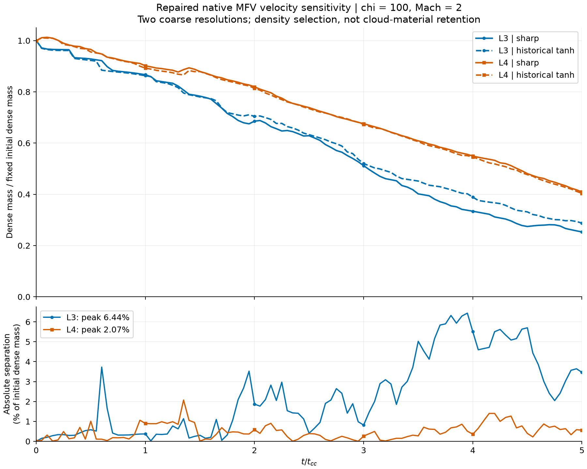

# Repaired native MFV: level-3/level-4 velocity sensitivity

8 September 2026. **Share with the caveats below.** Both new level-4 runs
finished and passed all 101 native states through 5 t_cc. Together with the
already accepted level-3 pair, this comparison contains four controls and
404 native states. No completed experiment was rerun. All raw data remains.

## Result

At fixed chi=100 and Mach=2, how much does the historical tanh velocity law
change the density-selected mass compared with sharp velocity at 1.3 R?

| Initial resolution | Peak absolute separation / initial dense mass | Time of peak (t/t_cc) | Final sharp / historical mass fractions |
| --- | ---: | ---: | --- |
| L3: 64 x 32 x 32 | 6.438% | 3.95 | 0.25306 / 0.28771 |
| L4: 128 x 64 x 64 | 2.072% | 1.35 | 0.40930 / 0.40370 |

These percentages are not errors against an exact solution. The paired
effect is smaller at L4, but these two coarse levels do not establish
convergence, physical insignificance, or permission to reuse every old run.
The initial sampling gives only 3.2 and 6.4 elements per cloud radius.

## Sources and method

L3 reuses the accepted [paired scalar report](../mfv_repaired_pair.json), SHA256
`db45f9d985a4e8eb87b63f0247d1d5f61572acfaab5dad6f9272dfe36b0a017d`.
Its complete native field and restart checks were not repeated. The new
[L4 batch](full_l4_batch.json) contains the independently checked mass series,
cadence, resources and terminal restart accounting for each new run.

Both resolutions use the same native GIZMO MFV executable with the existing
isolated mass-flux timestep repair, SHA256
`4784336422c25db4714c6f56ef95337347f4be18dfd622e2b7e9acf7e1fe3d3c`.
Original failed MFV runs are excluded. No MFM trajectory is used: only the
matching initial-condition arrays were reused after native validation.

Within each level/pair, binary, parameters, density/thermal IC, sampling,
seed, periodic box and numerics are unchanged. Only the velocity IC differs.
Chi=100, Mach=2, gamma=5/3, R=1, nominal wind density/pressure=1,
density tanh width=0.1R and velocity radius=1.3R remain fixed. Sharp velocity
is zero through 1.3R and wind velocity outside; historical velocity retains
its tanh transition. L4 full parameter files are byte-identical.

Dense mass selects rho > initial cloud density/3. Both laws at each level
share one fixed measured initial dense-mass denominator: 409.90798234939575
for L3 and 398.4896878004074 for L4, in code-mass units. The differing
denominators reflect native sampling; they are not adjusted at later times.
Every actual native time appears in the upper plot. Only the descriptive
peak uses linear interpolation of scalar curves onto 0:0.05:5 t_cc. No
3D frame is synthesized, discarded, duplicated or retimed. All four runs
actually have 101 saved states; this count was read from their records.

## Validation

Both new runs passed independent direct/yt checks for every saved state,
positive finite fields, all 524288 IDs, paired initial fields, the native
60-bit output clock, and terminal conserved-plus-pending mass accounting.
No repeat of the original stored-energy failure occurred. Minimum stored
internal energies across L4 are 0.00732363 and 0.00729159 for sharp/historical.

The new scalar stage verifies all 202 L4 snapshot and 16 retained restart
hashes, 39 frozen source/input pins, identical case/batch records and native
resource samples. Fourteen new scalar/metadata tests pass. A separate
pure-Python interpolation reproduces NumPy results to 2.23e-16 absolute
fraction difference. The accepted L3 scalar series/metrics reproduce exactly.
No native field analysis or old solver experiment was rerun.

The terminal MassTrue plus pending dMass residual is -1.124e-13 / -4.300e-14
code mass. Both pass the unchanged predeclared engineering accumulation
gate. Snapshot predicted mass alone is not this conserved ledger. This
gate is not a physical-accuracy or arbitrary-flux theorem.

## Resources and preserved files

| New L4 run | Solver wall time | Median busy CPU workers | Peak solver-child RAM |
| --- | ---: | ---: | ---: |
| Sharp | 29m33s | 7.9966 | 1.688 GiB |
| Historical tanh | 28m58s | 7.9965 | 1.684 GiB |

These are CPU-only native solvers. The GPU was not used. Analysis time is
separate. L3 stored raw on ext4, L4 on Windows C:, so timing ratios are not
controlled scaling benchmarks or forecasts for level 6. Both runs exited
normally; the historical run started automatically after sharp validation.

New raw root:
`C:/Users/kaanb/CloudCrushing/native_runs/sensitivity_20260907/mfv_L4_velocity_pair_v1`.
Each law directory retains `ics.hdf5`, `params.txt`, native HDF5 snapshots,
restart files, `run.log`, resource samples and validation records. No old or
new raw file was deleted. The frozen native runner is
`/home/kaan/sensitivity_20260907/gizmo/mfv_timestep_repair_v1/l4_full_runner_v1`.

## Required caveats and next decision

The original kernel pressure is slightly nonuniform (L4 0.99907852 to
0.99913334 times nominal), identical within each velocity pair. Different
codes retain different boundary/pressure recipes; this does not certify
universal cross-code equivalence. Fully periodic boundaries allow material
to recirculate. MFV particle IDs are not passive material tracers: these
are density-selected mass curves, not an all-material-retained Figure 1.

Native evolved velocities are half-kick staggered. This result does not
validate velocity fields as simultaneous with their snapshot header times.
Restart prefix/byte verification does not certify checkpoint-resume behavior.
Cooling, other Mach numbers, MHD, Galilean tracking and production viewer
entries remain separate work. Movies/meshes are not raw-data backups.

This adds two analyzed controls, bringing the study to **50 controls and
5,054 native analysis states**. Four L3/L4 Gasoline controls remain held on
their failed scientific validation gate; higher levels require additional
raw-retention storage. The old blanket replacement queue remains inactive.
Discuss the measured resolution trends with Ryan before deciding which
historical datasets need replacing; do not introduce a post-hoc threshold.

## Reproducibility and review

[New analysis script](../analyze_mfv_levels_v1.py),
[14 scalar/metadata tests](../test_mfv_levels_v1.py),
[full numerical report and native scalar series](report.json),
[machine-readable validation](validation.json), [review](QA.md),
[frozen full plan](full_l4_plan.json), [native full batch](full_l4_batch.json),
[Windows input readback](windows_readback.json),
[per-level preparation](../MFV_L4_PREPARATION_RESULTS.md).

The analysis script runs under `/home/kaan/venv/bin/python` in WSL. It
refuses to overwrite `mfv_analysis_levels_v1`, and the native runners
refuse existing runs. For future analysis, create a new versioned output
path and preserve this record; do not replay a completed native queue.

Report SHA256:
`9049de2e08bb01dc92332ff08006ad1fb4e041e80ebd65b22ab8aac50e44aefe`.
